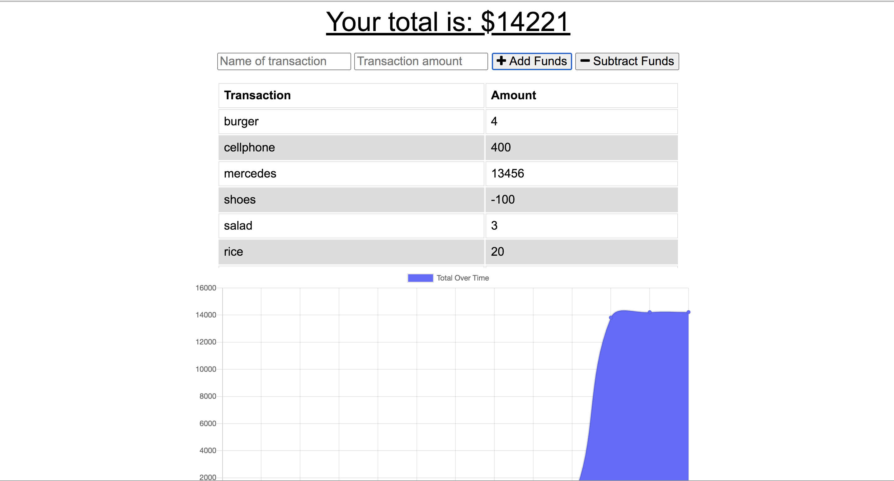

# Budget-Trackers

### Description:
Budget-Trackers is an application that allows users to add expenses and deposits to their budget with or without a connection.

Add functionality to our existing Budget Tracker application to allow for offline access and functionality.
The user will be able to add expenses and deposits to their budget with or without a connection. When entering transactions offline, they should populate the total when brought back online.
Offline Functionality:

Enter deposits offline

Enter expenses offline

When brought back online:

Offline entries should be added to tracker.

## Installation:
 Install dependencies by running npm install at the project root.

Start the app by running npm start from the project root.

Once the app starts open your browser to localhost:3000.

## Usage:
AS AN avid traveller
I WANT to be able to track my withdrawals and deposits with or without a data/internet connection
SO THAT my account balance is accurate when I am traveling

## License:
(https://img.shields.io/badge/license-MIT-blue.svg)

## A sample Application 

## Contributing
Ahmed Bule

## Questions:
For any questions, feel free to email me at ahmedbule01@gmail.com